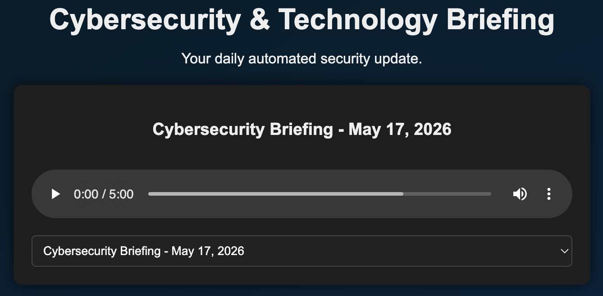
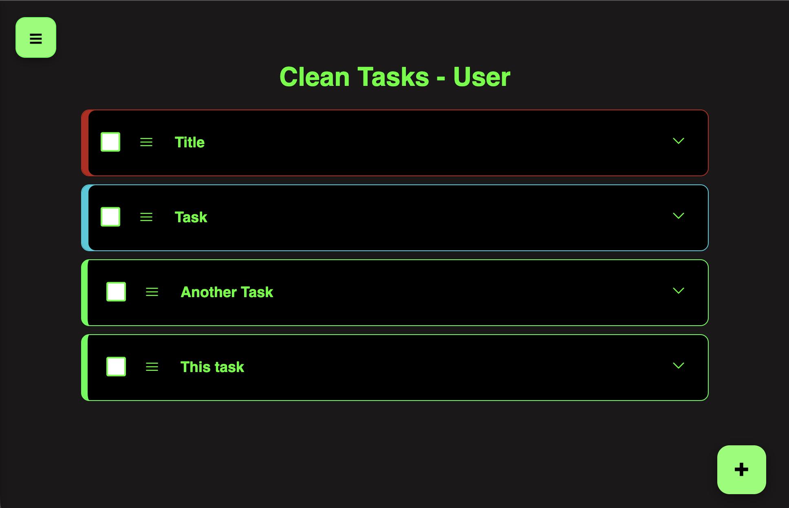

# \<Hello World\>

#### My name is Kevin! I'm a Full-Stack Software Engineering student specializing in backend architecture, database design, and intelligent web applications. I love building clean scalable solutions and integrating AI capabilities into modern web workflows. Always building, always learning. Explore my repositories below to see what I'm working on!

# Current Tech-Stack

---

# Featured Projects

## [Cyber Brief](https://github.com/K3V1N32/cyber-brief-podcast)
<picture></picture>

*An automated pipeline for aggregating, synthesizing, and broadcasting daily cybersecurity intelligence*
* **Tech Stack:** Python, Edge TTS, PyDub, XML, Web Infrastructure
* **Key Achievements:**
  * **Automated Data Pipeline:** Built a robust scraping and aggregation engine that pulls real-time headlines from three leading cybersecurity intelligence sources daily.
  * **Dynamic Media Synthesis:** Automated the script compilation and audio engineering workflow, utilizing Edge TTS for natural voice generation and `pydub` to procedurally mix intros, outros, and background tracks.
  * **Data-Driven Architecture:** Engineered an automated XML schema generation process that dynamically populates and updates a hosted web interface, providing users access to a rolling 30-day archive of broadcast history.
* **Links:** [\[Live Demo\]](https://rathserver.org/podcast) [\[GitHub\]](https://github.com/K3V1N32/cyber-brief-podcast)

---

## [Clean Tasks](https://github.com/K3V1N32/CleanTasks)
<picture></picture>

*Extensible full-stack task management powered by an optimized, developer-friendly REST API backend with AI Task Summary Integration*
* **Tech Stack:** Python, FastAPI, SQLAlchemy, JavaScript, HTML5/CSS3
* **Key Achievements:**
  * **Developer-Centric REST API:** Designed and documented a flexible, high-performance RESTful API using FastAPI, prioritizing predictable endpoint structures and seamless third-party integration capabilities.
  * **Robust Data Modeling:** Utilized SQLAlchemy ORM to build a clean relational database schema, ensuring efficient data persistence, migrations, and query optimization for highly customizable user tasks.
  * **Dynamic UI Responsiveness:** Developed a modular, pure JavaScript frontend that consumes the custom backend API natively, delivering asynchronous UI updates and a smooth, reactive user experience.
* **Links:** [\[Live Demo\]](https://rathserver.org/cleantasks) [\[GitHub\]](https://github.com/K3V1N32/CleanTasks)

# Where to find me

  
  
  

<!--
**K3V1N32/K3V1N32** is a ✨ _special_ ✨ repository because its `README.md` (this file) appears on your GitHub profile.
-->
